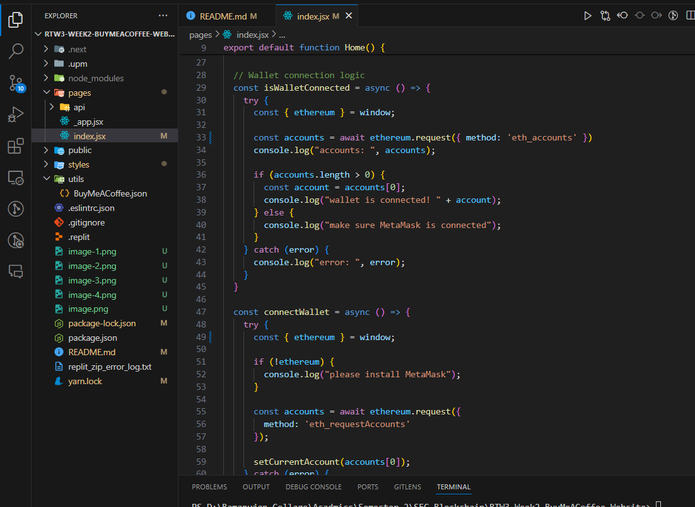

# BuyMeACoffee-Dapp

This is a simple Dapp that allows users to donate to a charity using the BuyMeACoffee API. The Dapp is built using Next.js and Solidity.

## Introduction

The Dapp is a simple implementation of the BuyMeACoffee. The Dapp allows users to donate to a ethereum using the BuyMeACoffee API.
I have created this Dapp using Next and Solidity. Very simple and easy to understand. 

## How to run this Dapp

1. Clone the repository

```bash
git clone 
```

2. I have uploaded the frontend and backend code in the respective directories. with there dependencies. so no ndeet to install it manually

3. Run the frontend

```bash
cd frontend
npm run dev
```


THis  will launch the frontend on http://localhost:3000


Here you can connect your metamask wallet and BuyMeACoffee. its very simple and easy to understand.

## How to create this Dapp

### Prerequisites

- npm (npx) version 10.5.0
- node version v18.20.2

```bash
mkdir BuyMeACoffee-contracts
cd BuyMeACoffee-contracts
```

Inside this directory, we want to start a new npm project (default settings are fine):

```bash
npm init -y
```

Now we create a sample project:

```bash
npm hardhat init
```

```bash
888    888                      888 888               888
888    888                      888 888               888
888    888                      888 888               888
8888888888  8888b.  888d888 .d88888 88888b.   8888b.  888888
888    888     "88b 888P"  d88" 888 888 "88b     "88b 888
888    888 .d888888 888    888  888 888  888 .d888888 888
888    888 888  888 888    Y88b 888 888  888 888  888 Y88b.
888    888 "Y888888 888     "Y88888 888  888 "Y888888  "Y888

👷 Welcome to Hardhat v2.12.2 👷‍

? What do you want to do? … 
❯ Create a JavaScript project
  Create a TypeScript project
  Create an empty hardhat.config.js
  Quit
```

Agree to all the defaults (project root, adding a .gitignore, and installing all sample project dependencies):

```bash
✔ What do you want to do? · Create a JavaScript project
✔ Hardhat project root: · /Users/user/docs/new
✔ Do you want to install this sample project's dependencies with npm (@nomiclabs/hardhat-waffle ethereum-waffle chai @nomiclabs/hardhat-ethers ethers)? (Y/n) · y
```

To check if everything works properly, run:

```bash
npx hardhat test
```

The important folders and files are:

- contracts - folder where your smart contracts live
    - in this project we'll only create one, to organize our BuyMeACoffee logic
- scripts - folder where your hardhat javascript scripts live
    - we will write deploy logic
    - example buy-coffee script
    - and a withdraw script to cash out our tips
- hardhat.config.js - configuration file with settings for solidity version and deployment

Now use any code editor to open up the project folder! I like to use VSCode.


1. Rename the contract file to BuyMeACoffee.sol
2. Replace the contract code with the following:

```solidity
//SPDX-License-Identifier: Unlicense

// contracts/BuyMeACoffee.sol
pragma solidity ^0.8.0;

// Switch this to your own contract address once deployed, for bookkeeping!
// Example Contract Address on Goerli: 0xDBa03676a2fBb6711CB652beF5B7416A53c1421D

contract BuyMeACoffee {
    // Event to emit when a Memo is created.
    event NewMemo(
        address indexed from,
        uint256 timestamp,
        string name,
        string message
    );
    
    // Memo struct.
    struct Memo {
        address from;
        uint256 timestamp;
        string name;
        string message;
    }
    
    // Address of contract deployer. Marked payable so that
    // we can withdraw to this address later.
    address payable owner;

    // List of all memos received from coffee purchases.
    Memo[] memos;

    constructor() {
        // Store the address of the deployer as a payable address.
        // When we withdraw funds, we'll withdraw here.
        owner = payable(msg.sender);
    }

    /**
     * @dev fetches all stored memos
     */
    function getMemos() public view returns (Memo[] memory) {
        return memos;
    }

    /**
     * @dev buy a coffee for owner (sends an ETH tip and leaves a memo)
     * @param _name name of the coffee purchaser
     * @param _message a nice message from the purchaser
     */
    function buyCoffee(string memory _name, string memory _message) public payable {
        // Must accept more than 0 ETH for a coffee.
        require(msg.value > 0, "can't buy coffee for free!");

        // Add the memo to storage!
        memos.push(Memo(
            msg.sender,
            block.timestamp,
            _name,
            _message
        ));

        // Emit a NewMemo event with details about the memo.
        emit NewMemo(
            msg.sender,
            block.timestamp,
            _name,
            _message
        );
    }

    /**
     * @dev send the entire balance stored in this contract to the owner
     */
    function withdrawTips() public {
        require(owner.send(address(this).balance));
    }
}
```
### Create a buy-coffee.js script to test your contract

Under the scripts folder, there should be a sample script already populated sample-script.js. Let's rename that file to buy-coffee.js and paste in the following code:

```javascript
const hre = require("hardhat");

// Returns the Ether balance of a given address.
async function getBalance(address) {
  const balanceBigInt = await hre.ethers.provider.getBalance(address);
  return hre.ethers.utils.formatEther(balanceBigInt);
}

// Logs the Ether balances for a list of addresses.
async function printBalances(addresses) {
  let idx = 0;
  for (const address of addresses) {
    console.log(`Address ${idx} balance: `, await getBalance(address));
    idx ++;
  }
}

// Logs the memos stored on-chain from coffee purchases.
async function printMemos(memos) {
  for (const memo of memos) {
    const timestamp = memo.timestamp;
    const tipper = memo.name;
    const tipperAddress = memo.from;
    const message = memo.message;
    console.log(`At ${timestamp}, ${tipper} (${tipperAddress}) said: "${message}"`);
  }
}

async function main() {
  // Get the example accounts we'll be working with.
  const [owner, tipper, tipper2, tipper3] = await hre.ethers.getSigners();

  // We get the contract to deploy.
  const BuyMeACoffee = await hre.ethers.getContractFactory("BuyMeACoffee");
  const buyMeACoffee = await BuyMeACoffee.deploy();

  // Deploy the contract.
  await buyMeACoffee.deployed();
  console.log("BuyMeACoffee deployed to:", buyMeACoffee.address);

  // Check balances before the coffee purchase.
  const addresses = [owner.address, tipper.address, buyMeACoffee.address];
  console.log("== start ==");
  await printBalances(addresses);

  // Buy the owner a few coffees.
  const tip = {value: hre.ethers.utils.parseEther("1")};
  await buyMeACoffee.connect(tipper).buyCoffee("Carolina", "You're the best!", tip);
  await buyMeACoffee.connect(tipper2).buyCoffee("Vitto", "Amazing teacher", tip);
  await buyMeACoffee.connect(tipper3).buyCoffee("Kay", "I love my Proof of Knowledge", tip);

  // Check balances after the coffee purchase.
  console.log("== bought coffee ==");
  await printBalances(addresses);

  // Withdraw.
  await buyMeACoffee.connect(owner).withdrawTips();

  // Check balances after withdrawal.
  console.log("== withdrawTips ==");
  await printBalances(addresses);

  // Check out the memos.
  console.log("== memos ==");
  const memos = await buyMeACoffee.getMemos();
  printMemos(memos);
}

// We recommend this pattern to be able to use async/await everywhere
// and properly handle errors.
main()
  .then(() => process.exit(0))
  .catch((error) => {
    console.error(error);
    process.exit(1);
  });
```

```bash
PS D:\Ramanujan Collage\Acadmics\Semester 2\SEC Blockchain > npx hardhat run scripts/buy-coffee.js
Compiled 1 Solidity file successfully
BuyMeACoffee deployed to: 0x5FbDB2315678afecb367f032d93F642f64180aa3
== start ==
Address 0 balance:  9999.99877086625
Address 1 balance:  10000.0
Address 2 balance:  0.0
== bought coffee ==
Address 0 balance:  9999.99877086625
Address 1 balance:  9998.999752902808629985
Address 2 balance:  3.0
== withdrawTips ==
Address 0 balance:  10002.998724967892122376
Address 1 balance:  9998.999752902808629985
Address 2 balance:  0.0
== memos ==
At 1652033688, Carolina (0x70997970C51812dc3A010C7d01b50e0d17dc79C8) said: "You're the best!"
At 1652033689, Vitto (0x3C44CdDdB6a900fa2b585dd299e03d12FA4293BC) said: "Amazing teacher"
At 1652033690, Kay (0x90F79bf6EB2c4f870365E785982E1f101E93b906) said: "I love my Proof of Knowledge"
```

### Deploy your BuyMeACoffe.sol smart contract to the Ethereum Goerli testnet using Alchemy and MetaMask

Let's create a new file scripts/deploy.js that will be super simple, just for deploying our contract to any network we choose later (we'll choose Goerli later if you haven't noticed).

The deploy.js file should look like this:

```javascript
// scripts/deploy.js

const hre = require("hardhat");

async function main() {
  // We get the contract to deploy.
  const BuyMeACoffee = await hre.ethers.getContractFactory("BuyMeACoffee");
  const buyMeACoffee = await BuyMeACoffee.deploy();

  await buyMeACoffee.deployed();

  console.log("BuyMeACoffee deployed to:", buyMeACoffee.address);
}

// We recommend this pattern to be able to use async/await everywhere
// and properly handle errors.
main()
  .then(() => process.exit(0))
  .catch((error) => {
    console.error(error);
    process.exit(1);
  });
```


Now with this deploy.js script coded and saved, if you run the following command:

```bash
npx hardhat run scripts/deploy.js
```

You should see the following output:

```bash
BuyMeACoffee deployed to: 0x5FbDB2315678afecb367f032d93F642f64180aa3
```

Install dotenv:

```bash
npm install dotenv
```

Create a .env file in the root of your project and add the following:

```bash
touch .env
GOERLI_URL=https://eth-goerli.alchemyapi.io/v2/<your api key>
GOERLI_API_KEY=<your api key>
PRIVATE_KEY=<your metamask api key>
```

Run the deploy script, this time adding a special flag to use the Goerli network:

```bash
npx hardhat run scripts/deploy.js --network goerli
```

If all goes well, you should be able to see your contract address logged to the console after a few seconds:

```bash
BuyMeACoffee deployed to: 0xDBa03676a2fBb6711CB652beF5B7416A53c1421D
```


### Build the frontend Buy Me A Coffee website dapp with Replit and Ethers.js

It should look like this:



you can customize it as per your need in the index.js file inside the pages/api

